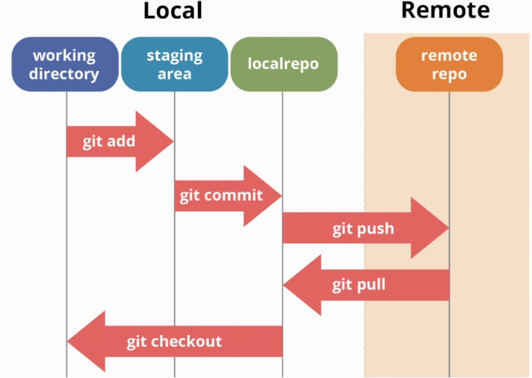
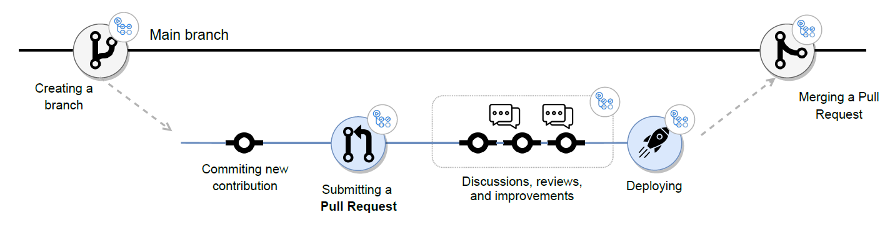

## Announcements/reminders

-   Today, sit at your table from last time.

-   ***Assignment for next class:***

    -   read [MDSR 9.1 -- 9.2](https://mdsr-book.github.io/mdsr2e/ch-foundations.html#samples-and-populations)

    -   prepare a [reading response](https://forms.gle/vUDh2DpNfNGdPHpE6)

## Objective for today

Learn how to interact with GitHub repositories:

-   retrieve and submit file changes;

-   examine repository updates;

-   use branches for parallel workflow;

-   resolve conflicts.

## Basic Git actions

## Branching workflow

## Activity overview

1.  Make individual changes to files and create 'commits'
2.  Create repository branches to enable you to work more efficiently in parallel.
3.  Merge branches with the main branch via pull request.
4.  Create and resolve a merge conflict.

## Setup

-   everyone should work from their own laptop

-   have everyone open their GitHub client, the group repository in RStudio, and the group repository in the browser on github.com

-   make sure everyone in the group is working with the same repository in the PSTAT 197 GitHub organization

-   make sure each group member has cloned the group repository to their own computer